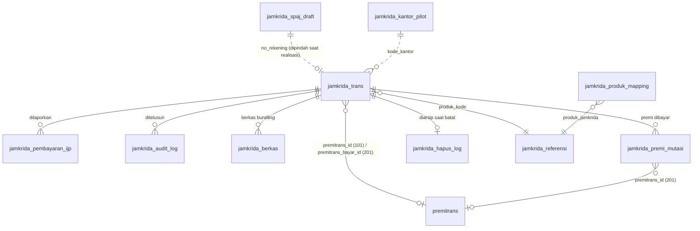

# 🗄️ Desain Database — API Jamkrida Jateng

> Rancangan basis data untuk produk **API Jamkrida Jateng**.

| Field             | Detail              |
|-------------------|---------------------|
| Produk            | API Jamkrida Jateng     |
| Jenis Dokumen     | Desain Database         |
| Versi             | 1.0.0               |
| Tanggal Dibuat    | 10 Oktober 2026              |
| Status            | 🟡 Draft            |
| Disusun oleh      |                     |
| Direview oleh     |                     |
| Disetujui oleh    |                     |

---


## 0. Ikhtisar & Konteks

Service memakai **dua datasource MySQL** yang di-wire manual:

| Datasource | Skema | Prefix config | Akses | Isi |
|------------|-------|---------------|-------|-----|
| **Primary** (`@Primary`) | `bkkjateng` | `app.datasource.primary` | Read-write | Tabel `jamkrida_*` + tabel CBS yang dibaca/ditulis (`premitrans`, `kredit`, `kretrans`, …) |
| **Sys** | `bkkjateng_sys` | `app.datasource.sys` | Read-only | `sys_daftar_user` — melengkapi `actor_username` di audit log |

Catatan penting:
- **MySQL 5.5** — tidak ada `DATETIME DEFAULT CURRENT_TIMESTAMP`; `created_at`/`updated_at` diisi
  aplikasi. `ADD INDEX/COLUMN IF NOT EXISTS` tidak tersedia, sehingga migrasi memakai pengecekan
  `information_schema` + `PREPARE`.
- `ddl-auto=none`. DDL `jamkrida_*` ada di `src/main/resources/db/migration/V1..V16` (idempotent),
  dijalankan **DBA** atau oleh `JamkridaSchemaMigrator` bila `app.migration.enabled=true`.
  Riwayatnya di `jamkrida_schema_history` (terpisah dari Flyway modul lain).
- Tabel CBS **tidak pernah** diubah lewat Flyway service; perubahannya berupa patch manual di `db/patch/`.
- Seluruh tabel baru InnoDB `utf8mb4`, kecuali `jamkrida_kantor_pilot` yang `utf8`.

## 1. Daftar Tabel

### 1.1 Milik service — DB `bkkjateng`

| Tabel | Fungsi | Migrasi |
|-------|--------|---------|
| `jamkrida_trans` | Data penjaminan per rekening kredit (pengganti `kre_jamkrida`) | V1, V2, V3, V5, V8, V12 |
| `jamkrida_pembayaran_ijp` | Riwayat laporan pembayaran IJP (`/bayarijp`), termasuk yang gagal | V1 |
| `jamkrida_audit_log` | Log setiap pemanggilan ke Jamkrida Online | V1 |
| `jamkrida_referensi` | Cache master data Jamkrida (5 tipe) | V1 |
| `jamkrida_spaj_draft` | Titipan SPAJ/scoring dari registrasi sampai realisasi | V4 |
| `jamkrida_produk_mapping` | Pemetaan type kredit CBS → produk Jamkrida + flag bundling | V6 → V11 (dibuat ulang) |
| `jamkrida_hapus_log` | Arsip penjaminan yang ikut terhapus saat realisasi dibatalkan | V7 |
| `jamkrida_premi_mutasi` | Fakta pembayaran premi yang boleh dibaca Jamkrida | V9, V10, V13, V16 |
| `jamkrida_berkas` | Berkas KTP/SPAJ/RIPLAY untuk `/addbundling` | V14 |
| `jamkrida_kantor_pilot` | Kantor yang diizinkan memakai integrasi | V15 |
| `jamkrida_schema_history` | Riwayat migrasi (dibuat Flyway) | — |

### 1.2 Tabel CBS yang disentuh — DB `bkkjateng`

| Tabel | Akses service | Keterangan |
|-------|---------------|------------|
| `premitrans` | **Tulis** (baris 101) & baca | Ledger premi. Ditambah 5 kolom lewat patch (§2.2) |
| `kredit` | Baca | `premi` untuk rekon |
| `kretrans` | Baca | `premi` baris realisasi (`my_kode_trans=100`) untuk rekon |
| `tabung`, `nasabah` | Baca | Nama rekening Jamkrida (backfill V13) |
| `kre_hapus_realisasi_log` | — (ditulis CBS) | Jejak pembatalan realisasi (patch) |
| `kre_jamkrida`, `log_kre_jamkrida` | Tidak disentuh | Masih dipakai layar pembatalan lama |

### 1.3 DB Sys (`bkkjateng_sys`)

| Tabel | Akses | Keterangan |
|-------|-------|------------|
| `sys_daftar_user` | Baca (service) | Nama pengguna untuk audit log |
| `sys_mysysid` | Baca (CBS) | `KRE_USING_JAMKRIDA_API`, `KRE_JAMKRIDA_API_URL`, `KRE_JAMKRIDA_API_KEY`, `KRE_JAMKRIDA_REK_PREMI` |
| `sys_modul`, `sys_rmodul` | Patch menu | Menu `TRXPREMIJK`, `MAPJKPRD`, `REFJKRD`, `AUDITJKR`, `PILOTJK` |

## 2. Detail Tabel

### 2.1 Tabel milik service

#### `jamkrida_trans`

| Kolom | Tipe | Null | Keterangan |
|-------|------|------|------------|
| `id` | BIGINT UNSIGNED AI | PK | |
| `trans_id_source` | BIGINT UNSIGNED | Ya | ID transaksi realisasi di CBS |
| `no_rekening` | VARCHAR(30) | Tidak | Rekening kredit |
| `no_pinjaman` | VARCHAR(50) | Ya | Nomor SPK |
| `kode_kantor` | VARCHAR(10) | Ya | |
| `cabang` | VARCHAR(50) | Ya | Kode cabang Jamkrida |
| `produk_kode` | VARCHAR(20) | Ya | `jamkrida_referensi.kode` (PRODUK) |
| `bundling` | TINYINT(1) | Tidak, def 0 | `0`=`/add`, `1`=`/addbundling`; dihitung ulang tiap rekon |
| `no_sertifikat` | VARCHAR(50) | Ya | Tidak pernah berisi kalimat `PENDING`/`CEK STATUS` |
| `nama_perusahaan`, `nomor_pks` | VARCHAR(150) | Ya | Dari respons Jamkrida |
| `tanggal_sertifikat` | DATE | Ya | |
| `nama_debitur` | VARCHAR(150) | Ya | |
| `tanggal_lahir` | DATE | Ya | |
| `usia` | SMALLINT UNSIGNED | Ya | |
| `no_identitas_masked` | VARCHAR(20) | Ya | NIK ter-mask, mis. `3322********2901` |
| `tanggal_akad_pinjaman`, `tanggal_akhir_pinjaman` | DATE | Ya | |
| `tenor_pinjaman` | SMALLINT UNSIGNED | Ya | |
| `nilai_pinjaman`, `ijp_gross`, `diskon`, `ijp_net` | DECIMAL(18,2) | Ya | |
| `status_kepesertaan` | VARCHAR(30) | Ya | `inforce`, `PENDING BUNDLING`, `APPROVED`, … |
| `status_cek_at` | DATETIME | Ya | V5 — cek status terakhir |
| `status_kirim` | TINYINT(1) | Tidak, def 0 | `0` belum, `1` terkirim, `2` gagal |
| `kirim_attempt` | INT | Tidak, def 0 | |
| `kirim_last_error` | VARCHAR(500) | Ya | |
| `kirim_at` | DATETIME | Ya | |
| `request_payload` | LONGTEXT | Ya | Payload `/add` lengkap (NIK & SPAJ apa adanya) untuk kirim ulang |
| `url_sertifikat` | VARCHAR(255) | Ya | Rujukan saja; unduhan selalu minta tautan baru |
| `premitrans_id` | INT | Ya | V2 — baris beban premi (101) |
| `premitrans_error` | VARCHAR(500) | Ya | V2 — alasan gagal bukukan premi |
| `premi_rekon_at` | DATETIME | Ya | V3 — rekon cocok terakhir; NULL = kirim terkunci |
| `premi_rekon_ijp` | DECIMAL(18,2) | Ya | V3 — IJP saat rekon cocok |
| `premi_dibayar_at` | DATETIME | Ya | V8 — setoran premi 201 di CBS |
| `premitrans_bayar_id` | INT | Ya | V8 — baris setoran (201) |
| `ijp_dibayar_at` | DATETIME | Ya | V12 — `/bayarijp` sukses |
| `ijp_no_referensi` | VARCHAR(50) | Ya | V12 |
| `tgl_trans`, `jam_trans` | DATE, TIME | Ya | Waktu realisasi |
| `user_id` | INT UNSIGNED | Ya | |
| `created_at`, `updated_at` | DATETIME | Ya | Diisi aplikasi |

Index: `UNIQUE (no_rekening, no_pinjaman)`, `status_kirim`, `no_sertifikat`, `tgl_trans`,
`kode_kantor`, `premitrans_id`.

#### `jamkrida_pembayaran_ijp`

| Kolom | Tipe | Keterangan |
|-------|------|------------|
| `id` | BIGINT UNSIGNED AI PK | |
| `jamkrida_trans_id` | BIGINT UNSIGNED, FK → `jamkrida_trans.id` | |
| `no_rekening` | VARCHAR(30) | |
| `no_sertifikat` | VARCHAR(50) | |
| `nilai_ijp` | DECIMAL(18,2) NOT NULL | |
| `nilai_hf` | DECIMAL(18,2) NOT NULL def 0 | Feebase |
| `no_referensi_pembayaran`, `tgl_referensi_pembayaran` | VARCHAR(50), DATE | |
| `no_referensi_hf`, `tgl_pembayaran_hf` | VARCHAR(50), DATE | |
| `url_sertifikat`, `url_sertifikat_car` | VARCHAR(255) | `url_sertifikat_car` = sertifikat jiwa (bundling) |
| `status` | VARCHAR(20) | `success` / `failed` |
| `error_message` | VARCHAR(500) | |
| `user_id`, `created_at` | | |

#### `jamkrida_audit_log`

| Kolom | Tipe | Keterangan |
|-------|------|------------|
| `id` | BIGINT UNSIGNED AI PK | |
| `trace_id` | VARCHAR(36) NOT NULL | UUID per panggilan |
| `jamkrida_trans_id`, `no_rekening` | | Korelasi ke penjaminan |
| `endpoint` | VARCHAR(100) NOT NULL | `authenticate`, `cekijp`, `add`, `addbundling`, `detail`, `statusbundling`, `bayarijp`, `linksertifikat`, `sync_*` |
| `http_method`, `request_url` | VARCHAR(10), VARCHAR(255) | URL membuktikan lingkungan tujuan (dev/prod) |
| `request_payload`, `response_payload` | LONGTEXT | Sudah ter-mask; maks 60.000 karakter; isi berkas tidak disimpan |
| `http_status` | SMALLINT | |
| `is_success` | TINYINT(1) | |
| `error_message` | VARCHAR(500) | |
| `latency_ms` | INT | |
| `actor_user_id`, `actor_username`, `kode_kantor`, `client_ip` | | Pelaku |
| `created_at` | DATETIME | |

Index: `trace_id`, `no_rekening`, `endpoint`, `created_at`, `jamkrida_trans_id`.

#### `jamkrida_referensi`

| Kolom | Tipe | Keterangan |
|-------|------|------------|
| `id` | BIGINT UNSIGNED AI PK | |
| `tipe` | VARCHAR(20) | `PRODUK`, `JENIS_AGUNAN`, `SEKTOR_USAHA`, `CABANG`, `PEKERJAAN` |
| `kode` | VARCHAR(40) | |
| `nilai` | VARCHAR(255) | |
| `meta_json` | TEXT | Atribut tambahan (feebase, bundling, manfaat, status, pks) — ditimpa tiap sinkron |
| `is_active` | TINYINT(1) def 1 | `0` = sudah ditarik Jamkrida |
| `synced_at`, `updated_at` | DATETIME | |

`UNIQUE (tipe, kode)`.

#### `jamkrida_spaj_draft`

| Kolom | Tipe | Keterangan |
|-------|------|------------|
| `id` | BIGINT UNSIGNED AI PK | |
| `no_rekening` | VARCHAR(30) **UNIQUE** | |
| `no_pinjaman`, `kode_kantor` | | |
| `payload` | LONGTEXT NOT NULL | Body `/add` hasil registrasi (SPAJ, scoring, identitas) |
| `ijp_gross`, `diskon`, `ijp_net` | DECIMAL(18,2) | `ijp_net` = nominal premi saat realisasi |
| `user_id`, `created_at`, `updated_at` | | |

Ditulis CBS saat registrasi, dihapus CBS setelah `POST /kredit/realisasi` sukses.

#### `jamkrida_produk_mapping`

| Kolom | Tipe | Keterangan |
|-------|------|------------|
| `id` | BIGINT UNSIGNED AI PK | |
| `type_kredit` | VARCHAR(10) | `kre_kode_type.kode_type_kredit` = `kredit.type_kredit` |
| `produk_jamkrida` | VARCHAR(20) | `jamkrida_referensi.kode` (PRODUK) |
| `bundling` | TINYINT(1) def 0 | Sumber kebenaran pemilihan `/add` vs `/addbundling` |
| `is_active` | TINYINT(1) def 1 | |
| `created_at`, `updated_at` | | |

`UNIQUE (type_kredit, produk_jamkrida)`. Isian awal V11 (kesepakatan BPR, September 2026):

| Produk Jamkrida | Type kredit | Bundling |
|-----------------|-------------|----------|
| 3933 MENURUN (WP 75%) | 100, 200, 710 | tidak |
| 3934 MENURUN (JIWA WP 25%) | 100, 200, 710 | ya |
| 3935 TETAP (WP 75%) | 300, 310, 320, 500 | tidak |
| 3936 TETAP (JIWA WP 25%) | 300, 310, 320, 500 | ya |
| 4768 MENURUN (JIWA WP 75%) | 100, 200, 710 | ya |
| 4769 TETAP (JIWA WP 75%) | 300, 310, 320, 500 | ya |
| 4912 Subsidi bunga kelompok tani (menurun) | 100, 200, 710 | tidak |

> V11 **membuang** tabel versi V6 (berbasis `kre_produk.kode_produk`) karena satu produk kredit bisa
> dipakai beberapa type, sehingga datanya tidak dapat dikonversi baris per baris.

#### `jamkrida_hapus_log`

Arsip penjaminan yang ikut terhapus saat realisasi dibatalkan di CBS: `jamkrida_trans_id`,
`kretrans_id`, `no_rekening`, `no_pinjaman`, `nama_debitur`, `produk_kode`, `ijp_net`,
`status_kirim` (0/2 saat dihapus), `no_sertifikat`, `premitrans_id`, `premi_nominal`,
`kode_kantor`, `userid_hapus`, `tgl_hapus`, `jam_hapus`. Penjaminan yang sertifikatnya sudah terbit
**tidak** boleh dihapus (ditolak CBS).

#### `jamkrida_premi_mutasi`

| Kolom | Tipe | Keterangan |
|-------|------|------------|
| `id` | BIGINT UNSIGNED AI PK | |
| `jamkrida_trans_id` | BIGINT UNSIGNED | V16 index |
| `premitrans_id` | INT **UNIQUE**, NULL | Baris setoran 201; **NULL = baru ditandai** (V16) |
| `no_rekening` | VARCHAR(30) | Rekening **kredit** |
| `no_rekening_jamkrida`, `nama_rekening_jamkrida` | VARCHAR(30), VARCHAR(150) | V13 — rekening tujuan setoran saat itu (fakta transaksi) |
| `no_pinjaman`, `no_sertifikat` | | Kunci pencarian Jamkrida (V10 index `no_pinjaman`) |
| `kode_reff` | VARCHAR(30) | Nomor kuitansi |
| `tgl_bayar`, `nominal` | DATE, DECIMAL(18,2) | |
| `status` | TINYINT(1) def 1 | `1` dibayar, `0` dibatalkan |
| `kode_kantor` | VARCHAR(10) | |
| `flag_user_id`, `flag_at` | INT, DATETIME | V16 — tanda bayar sebelum setoran |
| `created_at` | DATETIME | |

Satu-satunya permukaan data yang dibaca Jamkrida (via `/publik/premi/status`) — tanpa saldo, tanpa
mutasi rekening koran, tanpa jurnal.

#### `jamkrida_berkas`

| Kolom | Tipe | Keterangan |
|-------|------|------------|
| `id` | BIGINT UNSIGNED AI PK | |
| `jamkrida_trans_id` | BIGINT UNSIGNED | |
| `jenis` | VARCHAR(10) | `KTP`, `SPAJ`, `RIPLAY` |
| `nama_file`, `content_type` | VARCHAR | |
| `ukuran` | INT UNSIGNED | byte, maks 5 MB |
| `isi` | MEDIUMBLOB | |
| `user_id`, `created_at` | | |

`UNIQUE (jamkrida_trans_id, jenis)` — unggah ulang menimpa. Disimpan di DB (ikut backup, tanpa volume
tambahan); `max_allowed_packet` server 1 GB.

#### `jamkrida_kantor_pilot`

| Kolom | Tipe | Keterangan |
|-------|------|------------|
| `kode_kantor` | VARCHAR(10) PK | |
| `aktif` | TINYINT(1) def 1 | |
| `catatan` | VARCHAR(255) | |
| `created_at`, `updated_at`, `updated_by` | | |

Isian awal V15: `000` (pusat, pemantauan), `001` (KC Utama, piloting tahap 1). Dibaca CBS, service, dan web.

### 2.2 Perubahan tabel CBS (patch manual)

`db/patch/premitrans_kolom_pembayaran.sql` — **hanya bila `premitrans` sudah ada**:

| Kolom baru | Tipe | Keterangan |
|------------|------|------------|
| `kode_asuransi` | CHAR(3) | `001` = Jamkrida |
| `kode_trans` | CHAR(5) | Kode transaksi CBS |
| `no_rekening_jamkrida` | VARCHAR(30) | Rekening tabungan tujuan setoran |
| `kuitansi`, `kuitansi_id` | VARCHAR(30) | |

Baris `premitrans` yang relevan:

| `my_kode_trans` | Ditulis oleh | Arti |
|-----------------|--------------|------|
| `101` | Service (`POST /kredit/realisasi`) | Beban premi = `ijp_net` hasil Cek IJP |
| `201` | CBS (`020252`) | Setoran premi ke rekening tabungan Jamkrida |

Saldo premi belum disetor = Σ101 − Σ201 per rekening.

`db/patch/kre_hapus_realisasi_log.sql` — tabel jejak pembatalan realisasi (bentuk mengikuti IbsJabarGroup).

## 3. Entity Relationship Diagram (ERD)



Hanya `jamkrida_pembayaran_ijp → jamkrida_trans` yang FK fisik; relasi lain logis (kunci natural/ID).

## 4. Aturan Bisnis Terkait Data

| Kode | Aturan |
|------|--------|
| DR-01 | `jamkrida_trans` unik per `(no_rekening, no_pinjaman)`; realisasi ulang menimpa selama `status_kirim≠1`. |
| DR-02 | `premi_rekon_at` NULL ⇒ kirim terkunci. Rekon yang tidak cocok **mengosongkan** nilai lama. |
| DR-03 | Klaim kirim lewat satu `UPDATE … SET status_kirim=2, kirim_attempt=kirim_attempt+1 WHERE id=? AND status_kirim<>1` atomik — baris diklaim berstatus "gagal" sampai Jamkrida menjawab sukses, sehingga proses yang terputus tidak meninggalkan status "terkirim" palsu. Klaim yang tidak mengenai baris → 409. |
| DR-04 | `no_sertifikat` tidak menyimpan teks yang mengandung `PENDING` / `CEK STATUS` (setelah normalisasi). |
| DR-05 | Maksimal satu `jamkrida_pembayaran_ijp.status='success'` per penjaminan; sukses mengisi `ijp_dibayar_at`. |
| DR-06 | `jamkrida_premi_mutasi` status 1 ⇒ "sudah dibayar" bagi Jamkrida, baik sudah disetor (`premitrans_id` terisi) maupun baru ditandai. |
| DR-07 | Rekening tujuan setoran dicatat di `jamkrida_premi_mutasi` saat transaksi, bukan dibaca dari konfigurasi saat ditanya. |
| DR-08 | NIK di `jamkrida_trans` hanya versi ter-mask, **kecuali** di `request_payload` (dibutuhkan kirim ulang) — retensi/enkripsi menunggu compliance. |
| DR-09 | Pemilihan `/add` vs `/addbundling`: flag dari CBS → `jamkrida_produk_mapping.bundling` → `meta_json` referensi. |
| DR-10 | Baris referensi yang ditarik Jamkrida tetap disimpan (`is_active=0`) untuk penelusuran penjaminan lama. |

## 5. DDL

DDL lengkap ada di repo service (`src/main/resources/db/migration/`), dijalankan berurutan:

| Script | Isi |
|--------|-----|
| `V1__jamkrida_schema.sql` | `jamkrida_trans`, `jamkrida_pembayaran_ijp`, `jamkrida_audit_log`, `jamkrida_referensi` |
| `V2__jamkrida_trans_premitrans.sql` | `premitrans_id`, `premitrans_error` |
| `V3__jamkrida_trans_rekon_premi.sql` | `premi_rekon_at`, `premi_rekon_ijp` |
| `V4__jamkrida_spaj_draft.sql` | `jamkrida_spaj_draft` |
| `V5__jamkrida_trans_status_cek.sql` | `status_cek_at` |
| `V6__jamkrida_produk_mapping.sql` | `jamkrida_produk_mapping` (versi lama) |
| `V7__jamkrida_hapus_log.sql` | `jamkrida_hapus_log` |
| `V8__jamkrida_trans_premi_dibayar.sql` | `premi_dibayar_at`, `premitrans_bayar_id` |
| `V9__jamkrida_premi_mutasi.sql` | `jamkrida_premi_mutasi` |
| `V10__jamkrida_premi_mutasi_pinjaman.sql` | Index `no_pinjaman` |
| `V11__jamkrida_produk_mapping_type_kredit.sql` | Pemetaan berbasis `type_kredit` + `bundling` (**tabel lama dibuang**) |
| `V12__jamkrida_trans_ijp_dibayar.sql` | `ijp_dibayar_at`, `ijp_no_referensi` + backfill |
| `V13__jamkrida_premi_mutasi_rekening.sql` | Rekening tujuan setoran + backfill |
| `V14__jamkrida_berkas.sql` | `jamkrida_berkas` |
| `V15__jamkrida_kantor_pilot.sql` | `jamkrida_kantor_pilot` + isian awal |
| `V16__jamkrida_premi_mutasi_flag.sql` | `premitrans_id` nullable, `flag_user_id`, `flag_at`, index `jamkrida_trans_id` |

Contoh DDL inti:

```sql
CREATE TABLE IF NOT EXISTS `jamkrida_premi_mutasi` (
  `id` BIGINT UNSIGNED NOT NULL AUTO_INCREMENT,
  `jamkrida_trans_id` BIGINT UNSIGNED DEFAULT NULL,
  `premitrans_id` INT DEFAULT NULL COMMENT 'NULL = baru ditandai, belum disetor',
  `no_rekening` VARCHAR(30) NOT NULL COMMENT 'Rekening kredit, bukan rekening tabungan',
  `no_rekening_jamkrida` VARCHAR(30) DEFAULT NULL,
  `nama_rekening_jamkrida` VARCHAR(150) DEFAULT NULL,
  `no_pinjaman` VARCHAR(50) DEFAULT NULL,
  `no_sertifikat` VARCHAR(50) DEFAULT NULL,
  `kode_reff` VARCHAR(30) DEFAULT NULL,
  `tgl_bayar` DATE DEFAULT NULL,
  `nominal` DECIMAL(18,2) DEFAULT NULL,
  `status` TINYINT(1) NOT NULL DEFAULT 1 COMMENT '1=dibayar, 0=dibatalkan',
  `kode_kantor` VARCHAR(10) DEFAULT NULL,
  `flag_user_id` INT DEFAULT NULL,
  `flag_at` DATETIME DEFAULT NULL,
  `created_at` DATETIME DEFAULT NULL,
  PRIMARY KEY (`id`),
  UNIQUE KEY `uq_jamkrida_premi_mutasi_premitrans` (`premitrans_id`),
  KEY `idx_jamkrida_premi_mutasi_sertifikat` (`no_sertifikat`),
  KEY `idx_jamkrida_premi_mutasi_rek` (`no_rekening`),
  KEY `idx_jamkrida_premi_mutasi_tgl` (`tgl_bayar`),
  KEY `idx_jamkrida_premi_mutasi_pinjaman` (`no_pinjaman`),
  KEY `idx_jamkrida_premi_mutasi_trans` (`jamkrida_trans_id`)
) ENGINE=InnoDB DEFAULT CHARSET=utf8mb4;
```

---

## 📑 Riwayat Revisi

| Versi | Tanggal | Penyusun | Deskripsi Perubahan |
|-------|---------|----------|---------------------|
| 1.0.0 | 10 Oktober 2026 | | Dokumen dibuat — skema versi 16 |

---

*[← Kembali ke API Jamkrida Jateng](README.md)* · *[Daftar Produk](../../README.md)*

*Dibuat otomatis oleh **Analyst CLI**.*
