# 🗄️ Desain Database — BIRU App

> Rancangan basis data **BIRU App**: dua datasource terpisah (CORE sumber read-only, BIRU tujuan read/write), struktur tabel replikasi, tabel login & audit, serta strategi kunci dan idempotensi.

| Field             | Detail              |
|-------------------|---------------------|
| Produk            | BIRU App            |
| Jenis Dokumen     | Desain Database     |
| Versi             | 1.0.0               |
| Tanggal Dibuat    | 30 Juli 2026        |
| Status            | 🟡 Draft            |
| Disusun oleh      |                     |
| Direview oleh     |                     |
| Disetujui oleh    |                     |

---

## 0. Ikhtisar & Konteks

Aplikasi berbicara dengan **dua database MySQL yang terpisah penuh**, masing-masing dengan tumpukan
JPA sendiri. Ini batasan arsitektur utamanya, dan berpengaruh pada setiap perubahan persistensi.

| | **CORE** (sumber) | **BIRU** (tujuan) |
|---|---|---|
| Isi | Core banking BPR (IBS) | Database pelaporan |
| Versi | MySQL 5.5 (umumnya) | MySQL 8 |
| Akses aplikasi | **SELECT saja, read-only** | read/write |
| Prefix konfigurasi | `core.datasource.hikari.*` | `spring.datasource.hikari.*` |
| Paket entity | `model/core/**` | `model/biru/**` |
| Paket repository | `repository/core/**` | `repository/biru/**` |
| EntityManagerFactory | `coreEntityManagerFactory` | `biruEntityManagerFactory` (primary) |
| TransactionManager | `coreTransactionManager` | `biruTransactionManager` |
| Bean JDBC | `coreNamedParamJdbcTemplate` | `biruJdbcTemplate` / `biruNamedJdbcTemplate` |
| Pool (default template) | maks 10 / min idle 2 | maks 10 / min idle 2 |

Aturan yang mengikutinya:

- Entity/repository baru **harus** berada di paket `core`/`biru` yang benar — lokasi paket itulah
  yang menentukan datasource mana yang diwiring.
- Setiap `@Transactional` **menyebut manajer transaksinya secara eksplisit**.
- **CORE tidak pernah ditulis.** Pagarnya berlapis: user database CORE hanya `GRANT SELECT`, dan
  datasource-nya `read-only=true`.
- Aplikasi berjalan `spring.jpa.hibernate.ddl-auto=none` — **tidak ada tabel yang dibuat otomatis**.
  Seluruh skema BIRU disiapkan DBA sebelum aplikasi dinyalakan.

### Sumber definisi skema

| Kelompok tabel | Sumber definisi resmi |
|----------------|-----------------------|
| `app_user`, `app_session`, `audit_log` | **`src/main/resources/db/auth_schema.sql`** di repo. Berkas ini dijalankan oleh pengujian integrasi terhadap MySQL 8 sungguhan, lalu repository asli dijalankan di atasnya — jadi ketidakcocokan DDL vs pemetaan entity menggagalkan build, bukan muncul sebagai `Unknown column` di server BPR. |
| Tabel data BIRU (transaksi, nominatif, CIF, watermark) | Skrip DBA + patch `ALTER` yang didaftarkan pada dokumen deployment / *deployment notes* di `CHANGELOG.md`. Pemetaan entity JPA adalah acuan nama & tipe kolomnya. |
| Tabel CORE | **Dikelola IBS/DBA BPR.** BIRU hanya mendaftarkan kolom prasyarat yang dibacanya. |

---

## 1. Daftar Tabel

### 1.1 Database BIRU (read/write)

| No | Tabel | Kelompok | Deskripsi | Pola tulis |
|----|-------|----------|-----------|------------|
| 1 | `t_transaction_tab` | Transaksi | Transaksi tabungan hasil replikasi | `INSERT IGNORE` (batch) |
| 2 | `t_transaction_dep` | Transaksi | Transaksi deposito | `INSERT IGNORE` (batch) |
| 3 | `t_transaction_krd` | Transaksi | Transaksi kredit | `INSERT IGNORE` (batch) |
| 4 | `saving_nominatif` | Snapshot | Posisi rekening tabungan per tanggal laporan | `INSERT … ON DUPLICATE KEY UPDATE` |
| 5 | `deposit_nominatif` | Snapshot | Posisi rekening deposito per tanggal laporan | `INSERT … ON DUPLICATE KEY UPDATE` |
| 6 | `loan_nominatif` | Snapshot | Posisi kredit per tanggal laporan | `INSERT … ON DUPLICATE KEY UPDATE` |
| 7 | `m_cif` | Master | Data nasabah + penanda kepemilikan produk | `INSERT … ON DUPLICATE KEY UPDATE` |
| 8 | `etl_watermark` | Kontrol | Cursor & daftar kantor per ETL | `UPDATE` (di-seed manual) |
| 9 | `app_user` | Auth | Akun aplikasi | CRUD lewat administrasi |
| 10 | `app_session` | Auth | Sesi aktif (hash token) | INSERT / UPDATE (revoke) / DELETE (purge) |
| 11 | `audit_log` | Audit | Jejak seluruh aktivitas | INSERT (+ DELETE oleh retensi) |

### 1.2 Database CORE (read-only)

| No | Tabel | Dibaca untuk |
|----|-------|--------------|
| 1 | `tabtrans` | Transaksi tabungan (inkremental & backfill) |
| 2 | `deptrans` | Transaksi deposito |
| 3 | `kretrans` | Transaksi kredit + agregasi nominatif kredit |
| 4 | `tabung` | Nominatif tabungan, penanda `has_saving` |
| 5 | `deposito` | Nominatif deposito, penanda `has_deposit` |
| 6 | `kredit` | Nominatif kredit (plafon, tenor, jadwal), penanda `has_loan` |
| 7 | `nasabah` | Data CIF, nama nasabah pada transaksi |
| 8 | `kre_kode_jenis_penggunaan` | Deskripsi `loan_type` |
| 9 | `kre_kode_group1` | Nama RM (`rm_name`) |
| 10 | `ph_kredit_pyad` | Bunga akrual — **hanya bila `core.flavour=IBS_GEN2`** |

---

## 2. ERD (Logis)

```mermaid
erDiagram
    ETL_WATERMARK {
        varchar etl_name PK
        varchar branch_code PK
        datetime last_trx_time
        bigint last_trx_id
        datetime last_run_at
        varchar last_run_by
    }

    M_CIF {
        varchar cif PK
        varchar branch_code PK
        varchar full_name
        varchar id_card_number
        tinyint has_saving
        tinyint has_deposit
        tinyint has_loan
    }

    T_TRANSACTION_TAB {
        binary id PK
        bigint source_tabtrans_id UK
        varchar branch_code UK
        varchar account_number
        date transaction_date
        varchar customer_cif FK
        decimal principal_amount
    }

    T_TRANSACTION_DEP {
        binary id PK
        bigint source_deptrans_id UK
        varchar branch_code UK
        varchar account_number
        date transaction_date
        varchar customer_cif FK
        decimal principal_amount
    }

    T_TRANSACTION_KRD {
        binary id PK
        bigint source_kretrans_id UK
        varchar branch_code UK
        varchar account_number
        date transaction_date
        varchar customer_cif FK
        decimal principal_amount
    }

    SAVING_NOMINATIF {
        varchar branch_code PK
        date report_date PK
        varchar account_number PK
        varchar customer_cif FK
        decimal balance
    }

    DEPOSIT_NOMINATIF {
        varchar branch_code PK
        date report_date PK
        varchar account_number PK
        varchar customer_cif FK
        decimal balance
    }

    LOAN_NOMINATIF {
        varchar branch_code PK
        date report_date PK
        varchar account_number PK
        varchar customer_cif FK
        decimal outstanding_balance
        decimal interest_accrue
    }

    APP_USER {
        binary id PK
        varchar username UK
        varchar password_hash
        varchar role
        varchar branch_code
        tinyint is_active
    }

    APP_SESSION {
        binary token_hash PK
        binary user_id FK
        datetime expires_at
        datetime revoked_at
    }

    AUDIT_LOG {
        bigint id PK
        datetime at
        varchar username
        varchar action
        varchar target
        int row_count
    }

    M_CIF ||..o{ T_TRANSACTION_TAB : "customer_cif (logis)"
    M_CIF ||..o{ T_TRANSACTION_DEP : "customer_cif (logis)"
    M_CIF ||..o{ T_TRANSACTION_KRD : "customer_cif (logis)"
    M_CIF ||..o{ SAVING_NOMINATIF : "customer_cif (logis)"
    M_CIF ||..o{ DEPOSIT_NOMINATIF : "customer_cif (logis)"
    M_CIF ||..o{ LOAN_NOMINATIF : "customer_cif (logis)"
    APP_USER ||--o{ APP_SESSION : "user_id"
    APP_USER ||..o{ AUDIT_LOG : "username (salinan, tanpa FK)"
```



> **Relasi antar tabel data bersifat logis, bukan foreign key.** Tabel replikasi diisi per kantor
> secara paralel dan tidak berurutan; FK akan menolak baris transaksi yang tiba sebelum CIF-nya
> tersinkron, padahal keduanya sah dan akan konsisten pada siklus berikutnya. Konsistensi dijaga
> pada tingkat proses (rekonsiliasi), bukan constraint.
>
> `audit_log` **sengaja tanpa FK** ke `app_user`: jejak harus tetap ada ketika akunnya dihapus.

---

## 3. Struktur Tabel — Data Replikasi

### 3.1 `t_transaction_tab` — Transaksi Tabungan

| Kolom | Tipe | Null | Keterangan |
|-------|------|------|------------|
| `id` | BINARY(16) | ❌ | **PK** — UUID biner |
| `account_number` | VARCHAR(20) | ❌ | Nomor rekening |
| `account_destination` | VARCHAR(20) | ✅ | Rekening tujuan (transfer) |
| `transaction_date` | DATE | ❌ | Tanggal transaksi |
| `transaction_time` | DATETIME | ✅ | Waktu transaksi (bila core menyediakannya) |
| `principal_amount` | DECIMAL(18,2) | ❌ | Nominal pokok, default 0 |
| `trans_code` | VARCHAR(10) | ❌ | Kode transaksi core |
| `reference_number` | VARCHAR(50) | ✅ | Nomor referensi (hasil aturan domain) |
| `reference_code` | VARCHAR(255) | ✅ | Kode referensi |
| `channel` | VARCHAR(20) | ✅ | Kanal (hasil aturan domain) |
| `ip_address` | VARCHAR(45) | ✅ | IP asal transaksi bila ada |
| `device_id` | VARCHAR(100) | ✅ | Identitas perangkat bila ada |
| `phone_number` | VARCHAR(20) | ✅ | Telepon nasabah |
| `customer_cif` | VARCHAR(20) | ✅ | CIF nasabah |
| `customer_fullname` | VARCHAR(100) | ✅ | Nama nasabah |
| `receiver_fullname` | VARCHAR(100) | ✅ | Nama penerima |
| `userid` | VARCHAR(50) | ✅ | User core yang memproses |
| `authorize_id` | VARCHAR(50) | ✅ | User core yang mengotorisasi |
| `trx_desc` | VARCHAR(255) | ✅ | Keterangan |
| `insert_date` | DATETIME | ❌ | Waktu baris masuk BIRU |
| `insert_by` | VARCHAR(20) | ❌ | Default `ETL` |
| `reversal` | CHAR(1) | ❌ | `Y`/`N`, default `N` |
| `source_tabtrans_id` | BIGINT | ❌ | **Id baris asal di `tabtrans`** — dasar cursor & idempotensi |
| `source_module` | VARCHAR(255) | ✅ | Modul sumber di core |
| `source_link_id` | BIGINT | ✅ | Id keterkaitan di core |
| `branch_code` | VARCHAR(10) | ❌ | Kantor |

**Kunci & indeks**

| Nama | Jenis | Kolom | Kegunaan |
|------|-------|-------|----------|
| (PK) | PRIMARY | `id` | Identitas baris |
| `uq_source_tabtrans` | **UNIQUE** | `source_tabtrans_id`, `branch_code` | **Wajib.** Dasar `INSERT IGNORE`; diverifikasi saat startup |
| `idx_account_date` | INDEX | `account_number`, `transaction_date` | Query mutasi per rekening |
| `idx_transaction_date` | INDEX | `transaction_date` | Filter rentang tanggal |
| `idx_customer_cif` | INDEX | `customer_cif` | Query per nasabah |
| `idx_branch_code_date` | INDEX | `branch_code`, `transaction_date` | Query & rekonsiliasi per kantor |
| `idx_trans_code` | INDEX | `trans_code` | Analisis per jenis transaksi |
| `idx_insert_date` | INDEX | `insert_date` | Penelusuran hasil run ETL |

### 3.2 `t_transaction_dep` — Transaksi Deposito

Kolom sama dengan §3.1 **kecuali** `account_destination` dan `receiver_fullname` (tidak ada),
dengan `source_deptrans_id` sebagai id asal, ditambah:

| Kolom | Tipe | Null | Keterangan |
|-------|------|------|------------|
| `interest_amount` | DECIMAL(18,2) | ✅ | Nominal bunga |
| `tax_amount` | DECIMAL(18,2) | ✅ | Pajak bunga |
| `placement_date` | DATE | ✅ | Tanggal penempatan |
| `value_date` | DATE | ✅ | Tanggal valuta |
| `maturity_date` | DATE | ✅ | Jatuh tempo |
| `deposit_period` | INT | ✅ | Jangka waktu (bulan) |
| `interest_rate` | DECIMAL(5,2) | ✅ | Suku bunga |
| `aro_flag` | CHAR(1) | ✅ | Penanda ARO, default `N` |
| `maturity_treatment` | INT | ✅ | Perlakuan saat jatuh tempo |

**Kunci**: PK `id`; **UNIQUE `uq_source_deptrans` (`source_deptrans_id`, `branch_code`)** — wajib;
indeks `idx_dep_account_date`, `idx_dep_transaction_date`, `idx_dep_customer_cif`, dan indeks per
kantor/tanggal.

### 3.3 `t_transaction_krd` — Transaksi Kredit

Kolom inti sama dengan §3.1 (tanpa `account_destination`/`receiver_fullname`), id asal
`source_kretrans_id`, ditambah:

| Kolom | Tipe | Null | Keterangan |
|-------|------|------|------------|
| `installment_number` | SMALLINT | ✅ | Angsuran ke- |
| `interest_amount` | DECIMAL(18,2) | ✅ | Bunga |
| `penalty_amount` | DECIMAL(18,2) | ✅ | Denda |
| `provision_amount` | DECIMAL(18,2) | ✅ | Provisi |
| `stamp_amount` | DECIMAL(18,2) | ✅ | Bea materai |
| `insurance_amount` | DECIMAL(18,2) | ✅ | Asuransi |
| `notary_amount` | DECIMAL(18,2) | ✅ | Notaris |
| `admin_amount` | DECIMAL(18,2) | ✅ | Biaya administrasi |
| `linked_saving_account` | VARCHAR(20) | ✅ | Rekening tabungan terkait |

**Kunci**: PK `id`; **UNIQUE `uq_source_kretrans` (`source_kretrans_id`, `branch_code`)** — wajib;
indeks `idx_account_date`, `idx_transaction_date`, `idx_customer_cif`, dan indeks per kantor/tanggal.

### 3.4 `saving_nominatif` — Snapshot Tabungan

| Kolom | Tipe | Null | Keterangan |
|-------|------|------|------------|
| `branch_code` | VARCHAR(10) | ❌ | **PK-1** Kantor |
| `report_date` | DATE | ❌ | **PK-2** Tanggal laporan |
| `account_number` | VARCHAR(20) | ❌ | **PK-3** Nomor rekening |
| `customer_cif` | VARCHAR(20) | ✅ | CIF |
| `customer_fullname` | VARCHAR(100) | ✅ | Nama nasabah |
| `balance` | DECIMAL(18,2) | ✅ | Saldo |
| `interest_rate` | DECIMAL(6,4) | ✅ | Suku bunga |
| `product_code` | VARCHAR(10) | ✅ | Kode produk |
| `account_status` | CHAR(1) | ✅ | Status rekening |
| `insert_date` | DATETIME | ❌ | Waktu snapshot masuk BIRU |
| `insert_by` | VARCHAR(20) | ❌ | Default `ETL` |

**Kunci & indeks**: PRIMARY (`branch_code`, `report_date`, `account_number`) — sekaligus kunci
*upsert*; `idx_customer_cif` (`customer_cif`); `idx_account_number` (`account_number`).

### 3.5 `deposit_nominatif` — Snapshot Deposito

Struktur identik dengan §3.4 (PK dan kolom sama).

### 3.6 `loan_nominatif` — Snapshot Kredit

| Kolom | Tipe | Null | Keterangan |
|-------|------|------|------------|
| `branch_code` | VARCHAR(10) | ❌ | **PK-1** |
| `report_date` | DATE | ❌ | **PK-2** |
| `account_number` | VARCHAR(20) | ❌ | **PK-3** |
| `customer_cif` | VARCHAR(20) | ✅ | CIF |
| `customer_fullname` | VARCHAR(100) | ✅ | Nama nasabah |
| `product_code` | VARCHAR(10) | ✅ | Kode produk kredit |
| `loan_type` | VARCHAR(100) | ✅ | Deskripsi jenis penggunaan (tabel kode core) |
| `installment_type` | VARCHAR(20) | ✅ | Tipe angsuran |
| `rm_name` | VARCHAR(100) | ✅ | Nama RM / *account officer* |
| `account_status` | CHAR(1) | ✅ | Status rekening |
| `loan_amount` | DECIMAL(18,2) | ✅ | Plafon |
| `amount_transferred` | DECIMAL(18,2) | ✅ | Total pencairan |
| `outstanding_balance` | DECIMAL(18,2) | ✅ | **Baki debet** |
| `available_drawdown` | DECIMAL(18,2) | ✅ | Sisa yang dapat ditarik |
| `principal_unbilled` | DECIMAL(18,2) | ✅ | Pokok belum tertagih |
| `interest_unbilled` | DECIMAL(18,2) | ✅ | Bunga belum tertagih |
| `overdue_principal` | DECIMAL(18,2) | ✅ | Tunggakan pokok |
| `overdue_interest` | DECIMAL(18,2) | ✅ | Tunggakan bunga |
| `interest_accrue` | DECIMAL(18,2) | ✅ | **Bunga akrual** — sumber mengikuti `core.flavour` |
| `interest_rate` | DECIMAL(8,4) | ✅ | Suku bunga |
| `tenor` | INT | ✅ | Tenor (bulan) |
| `start_date` | DATE | ✅ | Tanggal mulai |
| `maturity_date` | DATE | ✅ | Jatuh tempo |
| `first_installment_date` | DATE | ✅ | Angsuran pertama |
| `last_installment_date` | DATE | ✅ | Angsuran terakhir |
| `installment_amount` | DECIMAL(18,2) | ✅ | Jumlah angsuran |
| `principal_billed` | DECIMAL(18,2) | ✅ | Pokok tertagih |
| `interest_billed` | DECIMAL(18,2) | ✅ | Bunga tertagih |
| `tenor_billed` | INT | ✅ | Tenor tertagih |
| `tenor_unbilled` | INT | ✅ | Tenor belum tertagih |
| `principal_overdue_days` | INT | ✅ | Hari tunggakan pokok |
| `interest_overdue_days` | INT | ✅ | Hari tunggakan bunga |
| `overdue_days` | INT | ✅ | Hari tunggakan |
| `tenor_overdue` | INT | ✅ | Tenor tunggakan |
| `insert_date` | DATETIME | ❌ | Waktu snapshot masuk BIRU |
| `insert_by` | VARCHAR(20) | ❌ | Default `ETL` |

**Kunci**: PRIMARY (`branch_code`, `report_date`, `account_number`).

> **Catatan riwayat kolom.** Dua kolom pernah bernama `principal_due` / `interest_due` padahal
> isinya angka *unbilled*; keduanya di-*rename* menjadi `principal_unbilled` / `interest_unbilled`
> di tempat (nilai lama tetap). Instalasi lama wajib menjalankan `ALTER` tersebut, dan patch
> penambahan kolom jadwal angsuran/billed-unbilled — tanpa itu setiap run nominatif kredit gagal
> dengan `Unknown column`. Perinciannya ada di [Deployment Guide §3](10-deployment-guide.md).

### 3.7 `m_cif` — Master Nasabah

| Kolom | Tipe | Null | Keterangan |
|-------|------|------|------------|
| `cif` | VARCHAR(20) | ❌ | **PK-1** CIF |
| `branch_code` | VARCHAR(10) | ❌ | **PK-2** Kantor |
| `full_name` | VARCHAR(100) | ✅ | Nama lengkap |
| `id_card_number` | VARCHAR(50) | ✅ | NIK KTP — dilebarkan menjadi 50 karena data BPR sering melebihi lebar default |
| `birth_place` | VARCHAR(50) | ✅ | Tempat lahir |
| `birth_date` | DATE | ✅ | Tanggal lahir |
| `gender` | CHAR(1) | ✅ | `L`/`P`; nilai lain **dinormalisasi menjadi NULL oleh aplikasi** |
| `address` | VARCHAR(255) | ✅ | Alamat |
| `postal_code` | VARCHAR(10) | ✅ | Kode pos |
| `phone_number` | VARCHAR(20) | ✅ | Telepon |
| `email` | VARCHAR(100) | ✅ | Email |
| `has_saving` | TINYINT(1) | ✅ | Punya tabungan aktif |
| `has_deposit` | TINYINT(1) | ✅ | Punya deposito aktif |
| `has_loan` | TINYINT(1) | ✅ | Punya kredit aktif |
| `insert_date` | DATETIME | ❌ | Waktu baris masuk BIRU |
| `insert_by` | VARCHAR(20) | ❌ | Default `ETL` |

**Kunci**: PRIMARY (`cif`, `branch_code`) — sekaligus kunci *upsert*.

> `branch_code` ikut menjadi bagian kunci karena satu CIF dikelola pada kantor tertentu; pemisahan
> per kantor inilah yang membuat pembatasan akses per kantor bisa dijalankan atas tabel ini.

### 3.8 `etl_watermark` — Kontrol ETL

| Kolom | Tipe | Null | Keterangan |
|-------|------|------|------------|
| `etl_name` | VARCHAR(50) | ❌ | **PK-1** Nama ETL |
| `branch_code` | VARCHAR(10) | ❌ | **PK-2** Kantor |
| `last_trx_time` | DATETIME | ❌ | Waktu transaksi terakhir. **Tampilan & titik mulai awal**, bukan filter |
| `last_trx_id` | BIGINT | ✅ | **Cursor** — satu-satunya filter inkremental |
| `last_run_at` | DATETIME | ✅ | Waktu run terakhir |
| `last_run_by` | VARCHAR(50) | ✅ | Pemicu terakhir (penjadwal / pengguna) |

**Kunci**: PRIMARY (`etl_name`, `branch_code`).

Nilai `etl_name` yang dikenal (7 baris per kantor):

```
TAB_TRANSACTION    DEP_TRANSACTION    KRD_TRANSACTION
SAVING_NOMINATIF   DEPOSIT_NOMINATIF  LOAN_NOMINATIF
CIF_SYNC
```

**Tabel ini adalah sumber daftar cabang.** Bila kosong, seluruh ETL berjalan tanpa error dan tanpa
memproses apa pun — inilah kegagalan paling sunyi pada instalasi baru.

Aturan seeding:

| `last_trx_time` | `last_trx_id` | Perilaku |
|-----------------|---------------|----------|
| terisi | terisi | Mulai persis dari cursor itu (paling eksplisit) |
| terisi | NULL | Aplikasi menurunkan batas id yang setara pada run pertama, lalu **menyimpannya** — pencarian ini sekali saja per kantor |
| NULL | NULL | Tidak dianjurkan: berarti mulai dari id 0 = **mereplikasi seluruh sejarah**; aplikasi hanya memberi peringatan keras (`last_trx_time` sendiri `NOT NULL`, jadi harus diisi) |

### 3.9 Mengapa cursor memakai `last_trx_id`, bukan `last_trx_time`

Query inkremental memfilter **hanya** `source_id > last_trx_id`. `last_trx_time` ditulis setiap
batch tetapi dibaca hanya oleh `/etl/status` dan gauge keterlambatan.

Alasannya: bila id transaksi di sebuah core tidak sempurna terurut waktu, baris dengan id lebih
besar tetapi timestamp lebih lama akan **terlewat permanen** oleh predikat waktu. Cursor berbasis id
tidak dapat kehilangan baris. Karena itu **jangan menambahkan predikat waktu** pada query
inkremental.

---

## 4. Struktur Tabel — Login & Audit

DDL resmi: `src/main/resources/db/auth_schema.sql`. Dijalankan di **database BIRU**, bukan CORE.

### 4.1 `app_user`

```sql
CREATE TABLE app_user (
  id                   BINARY(16)   NOT NULL,
  username             VARCHAR(64)  NOT NULL,
  password_hash        VARCHAR(72)  NOT NULL COMMENT 'BCrypt',
  full_name            VARCHAR(128) NOT NULL,
  role                 VARCHAR(16)  NOT NULL COMMENT 'VIEWER | OPS | ADMIN',
  branch_code          VARCHAR(8)   NULL     COMMENT 'NULL = semua kantor',
  is_active            TINYINT(1)   NOT NULL DEFAULT 1,
  must_change_password TINYINT(1)   NOT NULL DEFAULT 1,
  failed_attempts      INT          NOT NULL DEFAULT 0,
  locked_until         DATETIME     NULL,
  last_login_at        DATETIME     NULL,
  created_at           DATETIME     NOT NULL,
  updated_at           DATETIME     NOT NULL,
  PRIMARY KEY (id),
  UNIQUE KEY uk_app_user_username (username)
) ENGINE=InnoDB DEFAULT CHARSET=utf8mb4;
```

| Kolom | Catatan desain |
|-------|----------------|
| `password_hash` | BCrypt (72 karakter cukup untuk hash + salt). Tidak pernah menyimpan password |
| `role` | Disimpan sebagai string, bukan tabel role/permission: perannya hanya tiga dan tidak ada rencana izin per-endpoint, sehingga tabel tambahan hanya menambah join |
| `branch_code` | NULL = semua kantor; terisi = hanya kantor itu |
| `must_change_password` | Akun baru & hasil reset selalu `1` |
| `failed_attempts`, `locked_until` | Dasar penguncian sementara. **Penambahan penghitung ini harus tetap tersimpan meskipun login gagal** — bila ikut di-rollback, akun tidak akan pernah terkunci meski tampak seperti terkunci |
| `SYSTEM` | **Tidak pernah** ada di tabel ini; itu peran pemanggil ber-API key |

### 4.2 `app_session`

```sql
CREATE TABLE app_session (
  token_hash   BINARY(32)   NOT NULL COMMENT 'SHA-256 dari token cookie; tokennya sendiri tidak disimpan',
  user_id      BINARY(16)   NOT NULL,
  issued_at    DATETIME     NOT NULL,
  expires_at   DATETIME     NOT NULL,
  last_seen_at DATETIME     NOT NULL,
  revoked_at   DATETIME     NULL,
  ip           VARCHAR(45)  NULL,
  user_agent   VARCHAR(255) NULL,
  PRIMARY KEY (token_hash),
  KEY idx_session_user (user_id),
  KEY idx_session_expiry (expires_at)
) ENGINE=InnoDB DEFAULT CHARSET=utf8mb4;
```

**Mengapa sesi berupa baris database, bukan JWT.** Kebutuhan yang menentukan adalah "ada yang
resign, potong aksesnya sekarang" — dan token stateless tidak bisa melakukannya sebelum kedaluwarsa
tanpa daftar-cabut, yang pada akhirnya menjadi tabel ini juga. Yang disimpan hanya
`SHA-256(token)`: salinan backup yang bocor tidak dapat dipakai menyamar sebagai siapa pun.

| Kolom | Kegunaan |
|-------|----------|
| `expires_at` | Umur absolut sesi (default 12 jam) |
| `last_seen_at` | Dasar batas diam (default 60 menit); tidak ditulis setiap request, hanya bila sudah lebih tua dari interval tulis (default 60 s) |
| `revoked_at` | Terisi saat logout, ganti password, atau perubahan hak akses oleh admin |
| `idx_session_expiry` | Dipakai pembersihan berkala |

### 4.3 `audit_log`

```sql
CREATE TABLE audit_log (
  id        BIGINT       NOT NULL AUTO_INCREMENT,
  at        DATETIME(3)  NOT NULL,
  user_id   BINARY(16)   NULL,
  username  VARCHAR(64)  NOT NULL COMMENT 'Salinan, sengaja tanpa FK: jejak harus tetap ada saat user dihapus',
  action    VARCHAR(32)  NOT NULL COMMENT 'LOGIN_OK|LOGIN_FAIL|LOGOUT|PASSWORD_CHANGED|QUERY|ETL_TRIGGER',
  target    VARCHAR(160) NULL,
  params    VARCHAR(2000) NULL COMMENT 'Query string mentah, bukan JSON',
  row_count INT          NULL,
  status    VARCHAR(16)  NULL,
  ip        VARCHAR(45)  NULL,
  PRIMARY KEY (id),
  KEY idx_audit_at (at),
  KEY idx_audit_user_at (username, at),
  KEY idx_audit_action_at (action, at)
) ENGINE=InnoDB DEFAULT CHARSET=utf8mb4;
```

| Kolom | Catatan |
|-------|---------|
| `at` | Presisi milidetik: beberapa halaman export bisa jatuh pada detik yang sama |
| `username` | **Salinan**, bukan FK — jejak harus bertahan setelah akun dihapus. `SYSTEM` untuk pemanggil API key |
| `action` | `QUERY` mencakup **setiap halaman sebuah export** |
| `params` | Query string mentah + keterangan pembatasan kantor (`scope=…` / `deniedBranch=…`) |
| `row_count` | Diambil otomatis dari `meta.totalReturned` respons |
| `status` | Status HTTP — termasuk `403` untuk percobaan yang ditolak |
| Indeks | Tiga pola pencarian audit: per waktu, per orang, per jenis aksi |

**Pertumbuhan & retensi.** Tabel ini hanya bertambah: satu baris per request baca. Pembersihan
otomatis berjalan sekali sejam sesuai `app.auth.audit-retention` (default 400 hari — dipilih agar
satu siklus audit tahunan penuh selalu masih ada). Pantau ukurannya pada BPR bervolume besar:

```sql
SELECT COUNT(*) AS rows_now, MIN(at) AS oldest FROM audit_log;
```

---

## 5. Tabel CORE yang Dibaca

### 5.1 Prinsip: bacaan CORE ber-cakupan ETL, bukan cermin skema

Deployment menyasar BPR yang berbeda, dan tabel `tabtrans`/`deptrans`/`kretrans` mereka membawa
kolom lokal yang tidak sama. Karena itu:

- **Entity `model/core/**` hanya memetakan kolom yang dibaca ETL.** Jangan pernah men-*generate*
  ulang salah satunya dari `SHOW CREATE TABLE` sebuah BPR — kolom yang ada di satu bank dan tidak
  ada di bank lain akan **menggagalkan seluruh ETL domain itu**. `TabTrans` pernah diringkas dari 63
  menjadi 17 field justru karena alasan ini.
- **Query transaksi memproyeksikan skalar, bukan entitas**, sehingga hanya kolom yang dibutuhkan
  yang diminta ke core.
- **Ekspresi konstruktor mengikat berdasarkan posisi.** Urutan deklarasi field DTO dan daftar kolom
  pada query adalah satu kesatuan: menambah, menghapus, atau menukar urutan field berarti mengubah
  DTO **dan kedua** query (inkremental & per tanggal) secara serempak. Field bertipe sama yang
  tertukar urutannya tetap lolos kompilasi — dan diam-diam salah peta.
- **SQL nominatif natif melewati pemetaan entity**, jadi kolom yang dirujuknya harus ada di database
  meskipun tidak ada field entity yang memetakannya.

### 5.2 Tabel & kolom prasyarat

| Tabel CORE | Dibaca untuk | Kolom yang perlu diperhatikan |
|------------|--------------|-------------------------------|
| `tabtrans` | Transaksi tabungan | `jam_trans` (tidak ada di core generasi lama → perlu `ALTER`) |
| `deptrans` | Transaksi deposito | `jam_trans`, `kuitansi_id`, `kode_trans` |
| `kretrans` | Transaksi kredit + agregasi nominatif | `jam_trans`, `kuitansi_id`, `my_kode_trans`, dan `bunga`/`bunga_yad` bila `core.flavour=IBS_GEN1` |
| `tabung` | Nominatif tabungan, `has_saving` | — |
| `deposito` | Nominatif deposito, `has_deposit` | — |
| `kredit` | Nominatif kredit | `BI_JENIS_PENGGUNAAN`, `kode_group1` |
| `nasabah` | CIF & nama nasabah | `jenis_kelamin` (nilai selain `L`/`P` dinormalisasi aplikasi, **tanpa** meng-`UPDATE` CORE), `no_id` |
| `kre_kode_jenis_penggunaan` | Deskripsi `loan_type` | Tabel/kolom harus **ada**; baris yang tidak ada hanya membuat `loan_type` NULL |
| `kre_kode_group1` | `rm_name` | Idem |
| `ph_kredit_pyad` | Bunga akrual bila `core.flavour=IBS_GEN2` | `no_rekening`, `tgl_trans`, `my_kode_trans`, `bunga` |

Pemeriksaan cepat kolom wajib:

```sql
SELECT table_name, column_name
FROM information_schema.columns
WHERE table_schema = DATABASE()
  AND table_name IN ('tabtrans','deptrans','kretrans')
  AND column_name IN ('jam_trans','kuitansi_id','my_kode_trans','kode_trans')
ORDER BY table_name, column_name;
```

### 5.3 Ketika bacaan sempit belum cukup: `core.flavour`

Membaca sedikit kolom mengatasi core yang berbeda **satu kolom**. Ia tidak mengatasi core yang
menyimpan angka yang sama **di tabel berbeda**. Bunga akrual adalah kasus pertamanya:

| `core.flavour` | Sumber bunga akrual |
|----------------|---------------------|
| `IBS_GEN1` | Diturunkan dari `kretrans` (golongan 4 `bunga` dikurangi golongan 5 **`bunga_yad`** — dua sisi membaca kolom berbeda) |
| `IBS_GEN2` | Diturunkan dari tabel terpisah `ph_kredit_pyad` (golongan 4 dikurangi golongan 3, keduanya `bunga`) |

Tidak ada query yang benar untuk keduanya, dan **tidak ada nilai default** untuk properti ini —
menebak berarti menghitung bunga dari tabel yang salah. Aplikasi menjalankan query flavour terpilih
dalam bentuk tanpa-baris saat startup dan **menolak boot** bila tabel/kolomnya tidak ada; kalau
tidak, flavour yang salah akan gagal per kantor di dalam ETL — tempat exception ditangkap dan
dicatat — sehingga ETL tampak sehat sementara tidak menghasilkan apa pun.

### 5.4 Jangan pernah men-join tabel lookup ke query yang mengagregasi

Query nominatif melakukan `SUM` atas `kretrans` dan `GROUP BY no_rekening`. Menempelkan tabel
kode/lookup ke salah satunya gagal dalam dua cara, dan hanya yang pertama bersuara:

1. Di bawah `ONLY_FULL_GROUP_BY` — **aktif secara default di MySQL 5.7/8, dan ada core klien yang
   menjalankannya** — kolom lookup ditolak kecuali kunci join-nya unik. Kegagalan nyata:
   `Expression #7 … 'kg1.deskripsi_group1' … not functionally dependent`, karena `kre_kode_group1`
   tidak punya kunci sementara `kre_kode_jenis_penggunaan` kebetulan punya.
2. Bila tabel lookup memuat **dua baris untuk kode yang sama**, join **menggandakan baris
   `kretrans`** sebelum `GROUP BY`, sehingga baki debet dan total pencairan **berlipat**. Tanpa
   error — hanya angka uang yang salah.

Karena itu lookup diambil pada **batch per kantor tersendiri yang tidak mengagregasi `kretrans`**,
dengan setiap kolom non-grouped dibungkus `MAX(...)` agar aman apa pun kunci tabel kode klien, dan
baris kode ganda mengerut alih-alih berlipat.

**Verifikasi SQL CORE terhadap `sql_mode` bawaan MySQL.** Menjalankan container uji dengan
`--sql-mode=""` mematikan `ONLY_FULL_GROUP_BY` dan akan dengan senang hati menjalankan query yang
gagal di klien. Sertakan juga satu baris lookup ganda saat pengujian — itulah kegagalan yang **tidak
menghasilkan error sama sekali**.

---

## 6. Strategi Idempotensi

| Kelompok | Mekanisme | Kunci penentu | Perilaku saat berulang |
|----------|-----------|---------------|------------------------|
| `t_transaction_*` | `INSERT IGNORE` batch | UNIQUE (`source_*_id`, `branch_code`) | Baris yang sudah ada **diabaikan**, dihitung sebagai *skipped* — bukan error, bukan duplikat |
| `saving_nominatif`, `deposit_nominatif`, `loan_nominatif` | `INSERT … ON DUPLICATE KEY UPDATE` | PRIMARY (`branch_code`, `report_date`, `account_number`) | Snapshot tanggal yang sama **ditimpa** dengan nilai terbaru |
| `m_cif` | `INSERT … ON DUPLICATE KEY UPDATE` | PRIMARY (`cif`, `branch_code`) | Data nasabah diperbarui |
| `etl_watermark` | `UPDATE` per batch | PRIMARY (`etl_name`, `branch_code`) | Cursor hanya maju |

> **Proteksi duplikat bersandar sepenuhnya pada unique index di database.** Tanpa index itu,
> `INSERT IGNORE` tetap berjalan tanpa keluhan dan data transaksi menjadi dobel — angka pelaporan
> salah tanpa satu pun error. Karena itu aplikasi **memverifikasi ketiga index saat startup dan
> menolak jalan** bila ada yang hilang.

Saat menambah kolom pada entity transaksi, **semuanya** harus diubah serempak: entity, SQL
`INSERT IGNORE` beserta daftar parameternya, pemetaan di worker, DTO sumber, dan query CORE.

---

## 7. Konvensi Desain Data

| Aspek | Konvensi |
|-------|----------|
| PK tabel transaksi | UUID biner `BINARY(16)` |
| PK snapshot & master | Composite key alami (kantor + tanggal + rekening; atau CIF + kantor) |
| Uang | `DECIMAL(18,2)`, pembulatan HALF_UP pada 2 desimal |
| Suku bunga | `DECIMAL(6,4)` (tabungan/deposito) · `DECIMAL(8,4)` (kredit) · `DECIMAL(5,2)` (transaksi deposito) |
| Penanda ya/tidak | `CHAR(1)` `Y`/`N` (mis. `reversal`, `aro_flag`) atau `TINYINT(1)` (`has_*`, `is_active`) |
| Zona waktu | `Asia/Jakarta` pada Jackson & Hibernate |
| Charset | `utf8mb4` |
| Engine | InnoDB |
| Nama kolom | `snake_case`; kosakata **Inggris di BIRU**, Indonesia di CORE |
| Kolom jejak | `insert_date` + `insert_by` (default `ETL`) pada setiap tabel data |
| Foreign key antar tabel data | **Tidak dipakai** (lihat catatan pada ERD) |

**Pemetaan kosakata CORE → BIRU:**

| CORE (Indonesia) | BIRU (Inggris) |
|------------------|----------------|
| kantor | `branch_code` |
| nasabah | customer / CIF |
| rekening | `account_number` |
| tabungan | saving |
| deposito | deposit |
| kredit | loan / credit |
| nominatif | balance snapshot |

---

## 8. Estimasi Volume & Pertumbuhan

Angka acuan (perlu disesuaikan per BPR):

| Tabel | Perkiraan pertumbuhan | Catatan kapasitas |
|-------|----------------------|-------------------|
| `t_transaction_tab` | Terbesar; sebanding dengan volume transaksi harian × jumlah kantor | Indeks per (kantor, tanggal) menjadi penentu kecepatan query bulanan |
| `t_transaction_dep` | Kecil | — |
| `t_transaction_krd` | Sedang | — |
| `saving_nominatif` | **Jumlah rekening tabungan × jumlah tanggal snapshot** | Ini yang tumbuh diam-diam: snapshot harian selama setahun = 365× jumlah rekening |
| `deposit_nominatif` | Jumlah rekening deposito × tanggal snapshot | — |
| `loan_nominatif` | Jumlah rekening kredit × tanggal snapshot | Kolom paling banyak; perhatikan ukuran barisnya |
| `m_cif` | Sebanding jumlah nasabah (tidak tumbuh per hari) | — |
| `etl_watermark` | 7 × jumlah kantor | Tetap |
| `audit_log` | **Satu baris per request baca**, termasuk setiap halaman export | Dibatasi retensi (default 400 hari) |
| `app_session` | Sebanyak sesi aktif | Dibersihkan sekali sejam |

Rekomendasi operasional:

- Tentukan **kebijakan retensi snapshot nominatif** bersama unit pelaporan (mis. simpan harian
  untuk 13 bulan terakhir, lalu akhir bulan saja). Aplikasi tidak menghapus snapshot sendiri.
- Backup DB BIRU secara berkala; BIRU dapat dibangun ulang dari CORE lewat backfill, tetapi
  membangun ulang bertahun-tahun data berarti beban berat di core.
- Pantau ukuran `audit_log` dan `t_transaction_tab` sebagai dua tabel dengan pertumbuhan tercepat.

---

## 9. Hak Akses Database

```sql
-- di MySQL CORE (5.5) — read-only, pagar teknis atas aturan "BIRU tidak pernah menulis ke CORE"
CREATE USER 'biru_ro'@'%' IDENTIFIED BY 'password_kuat';
GRANT SELECT ON bank_core.* TO 'biru_ro'@'%';
FLUSH PRIVILEGES;

-- di MySQL BIRU (8)
CREATE USER 'biru'@'%' IDENTIFIED BY 'password_kuat';
GRANT SELECT, INSERT, UPDATE, DELETE ON dbbiru.* TO 'biru'@'%';
FLUSH PRIVILEGES;
```

Catatan:

- Ganti `'%'` dengan subnet Docker (`'172.%'`) bila kebijakan bank melarang wildcard penuh.
- User BIRU **tidak butuh** `CREATE`/`ALTER`/`DROP` saat operasi normal — DDL dijalankan DBA. Patch
  skema dilakukan oleh akun DBA tersendiri, bukan oleh akun aplikasi.

---

## 10. Aturan Perubahan Skema

| Perubahan | Yang harus dikerjakan |
|-----------|------------------------|
| Menambah kolom pada tabel **transaksi** BIRU | Entity + SQL `INSERT IGNORE` & daftar parameternya + pemetaan worker + DTO sumber + query CORE (inkremental **dan** per tanggal) + patch `ALTER` di dokumen deployment |
| Menambah kolom pada tabel **nominatif** BIRU | Entity + SQL upsert + pemetaan worker + query CORE + patch `ALTER` |
| Menambah field pada DTO sumber | Sesuaikan **urutan posisi** DTO dan **kedua** query dalam satu langkah (pengikatan berdasarkan posisi) |
| Membaca kolom CORE baru | Pastikan kolomnya ada di seluruh generasi core sasaran; bila tidak, daftarkan sebagai prasyarat `ALTER` per generasi |
| Membaca **figur dari tabel berbeda antar generasi** | Tambahkan entri per flavour pada peta query, prasyarat per generasi di *deployment notes*, dan satu baris di dokumen deployment |
| Menambah tabel auth/audit baru | `model/biru/**` + `repository/biru/**`, `@Transactional` menyebut manajer BIRU, DDL masuk `auth_schema.sql` (agar diuji terhadap MySQL sungguhan) |
| Menambah ETL/kantor baru | Tambah baris `etl_watermark`; tidak ada perubahan skema lain |

Prinsip: **ambil angka dari pembukuan core, jangan menghitungnya ulang di BIRU.** Core adalah dasar
laporan bank; perhitungan ulang hanya menciptakan angka kedua yang harus direkonsiliasi.

---

## 📑 Riwayat Revisi

| Versi | Tanggal | Penyusun | Deskripsi Perubahan |
|-------|---------|----------|---------------------|
| 1.0.0 | 30 Juli 2026 | | Dokumen dibuat |

---

*[← Kembali ke BIRU App](README.md)* · *[Daftar Produk](../../README.md)*

*Dikelola dengan **Analyst CLI**.*
