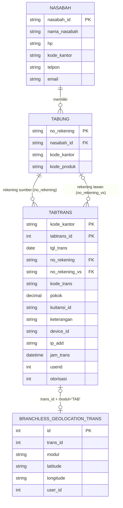
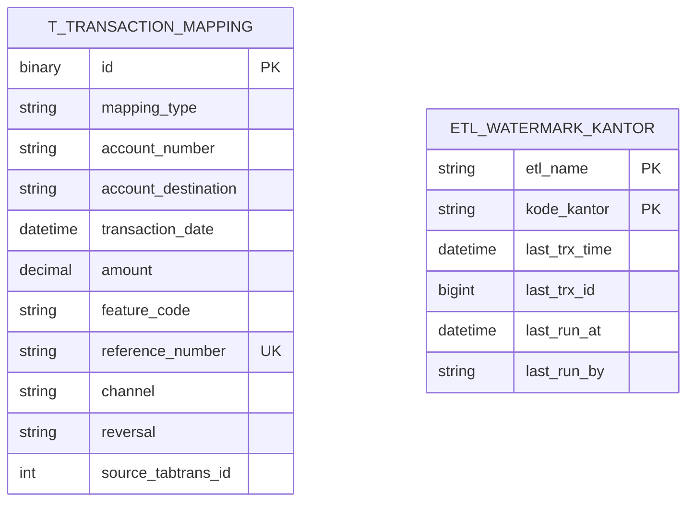

# 🗄️ Desain Database — FDS BKK Jateng

> Rancangan struktur basis data untuk produk **FDS BKK Jateng**.

| Field             | Detail              |
|-------------------|---------------------|
| Produk            | FDS BKK Jateng     |
| Jenis Dokumen     | Desain Database         |
| Versi             | 1.0.0               |
| Tanggal Dibuat    | 30 Juni 2026              |
| Status            | 🟡 Draft            |
| Disusun oleh      |                     |
| Direview oleh     |                     |
| Disetujui oleh    |                     |

---


## 1. Gambaran Umum

Sistem menggunakan **dua database terpisah**:

| Database | Engine | Skema | Peran | Akses |
|----------|--------|-------|-------|-------|
| **CORE** | MySQL 5.5 | `bkkjateng` | Sumber data core banking (NGS/IBS) | **Read-only** |
| **FDS** | MySQL 8 | `db_fraudsystem` | Tujuan data fraud detection + kontrol ETL | Read/Write |

> Aplikasi **tidak mengelola skema** (`spring.jpa.hibernate.ddl-auto=none`). Tabel sumber
> sudah ada di core banking; tabel FDS dibuat manual mengikuti desain di dokumen ini.
> Definisi kolom di bawah diturunkan dari pemetaan entity JPA — sebagian tipe (mis. panjang
> kolom di sisi CORE) merepresentasikan kolom yang **dibaca** ETL, bukan keseluruhan kolom
> fisik tabel core.

## 2. Entity Relationship Diagram

### 2.1 CORE (sumber — read-only)


### 2.2 FDS (tujuan)

> CORE dan FDS tidak punya foreign key lintas-database. Keterhubungan logis dijaga lewat
> `t_transaction_mapping.source_tabtrans_id` → `tabtrans.tabtrans_id`, dan
> `etl_watermark_kantor.kode_kantor` → `tabtrans.kode_kantor`.

## 3. Data Dictionary — CORE (Sumber, dibaca ETL)

### 3.1 `tabtrans` — Transaksi tabungan
PK gabungan: (`kode_kantor`, `tabtrans_id`).

| Kolom | Tipe | Null | Keterangan | Dipakai ETL untuk |
|-------|------|------|-----------|-------------------|
| `kode_kantor` | varchar(4) | N | PK — kode kantor/cabang | filter per kantor; reference number |
| `tabtrans_id` | int | N | PK — ID transaksi per kantor | watermark; `source_tabtrans_id` |
| `tgl_trans` | date | N | Tanggal transaksi | filter backfill (`= :date`) |
| `no_rekening` | varchar(20) | N | Rekening sumber (pengirim) | `account_number`; join nasabah |
| `no_rekening_vs` | varchar(20) | Y | Rekening lawan (penerima) | `account_destination`; join penerima |
| `kode_trans` | varchar(3) | Y | Kode jenis transaksi NGS | `feature_code`, `trkey` |
| `my_kode_trans` | int | N | Kode trans internal | — |
| `pokok` | decimal(18,4) | Y | Nominal transaksi | `amount` & `amount_decimal` |
| `adm`, `adm_penutupan` | decimal(18,2) | Y | Biaya administrasi | — |
| `keterangan` | varchar(250) | Y | Deskripsi transaksi | `trx_desc`; ekstraksi merchant QRIS |
| `keterangan1` | varchar(200) | Y | Deskripsi tambahan | — |
| `kuitansi` | varchar(20) | Y | No. kuitansi | — |
| `kuitansi_id` | varchar(20) | Y | ID kuitansi | `reference_number`; flag `reversal` |
| `modul_id_source` | varchar(3) | Y | Modul sumber | — |
| `trans_id_source` | int | Y | ID transaksi sumber | — |
| `issuerId` | varchar(25) | Y | ID issuer | — |
| `ip_add` | varchar(90) | Y | Alamat IP | `ip_address` |
| `device_id` | varchar(20) | Y | ID perangkat | `device_id`; penentu `channel` |
| `echannel_trans_desc` | varchar(150) | Y | Deskripsi e-channel | — |
| `verifikasi` | char(1) | Y | Status verifikasi | — |
| `posted_to_gl` | boolean | Y | Sudah posting ke GL | — |
| `flag`, `flag_excel`, `flag_insentif`, `flag_jt` | int/char(1) | Y | Penanda internal | — |
| `userid` | int | Y | User input (teller) | `teller_id` |
| `otorisasi` | int | Y | User otorisasi | `authorizer_id` |
| `counter_sign` | int | Y | Counter-sign | — |
| `jam` | time | Y | Jam transaksi | — |
| `jam_trans` | datetime | Y | Timestamp transaksi | `transaction_date`; **watermark** |
| `tgl_real_trans` | date | Y | Tanggal riil | — |
| `voucher_trans`, `premi_trans`, `pajak_trans`, `insentif_trans`, `return_bunga`, `biaya_trans` | decimal(18,2) | Y | Komponen nominal lain | — |

### 3.2 `tabung` — Rekening tabungan
| Kolom | Tipe | Null | Keterangan |
|-------|------|------|-----------|
| `no_rekening` | varchar(20) | N | PK — nomor rekening |
| `nasabah_id` | varchar(20) | N | FK → `nasabah.nasabah_id` |
| `kode_kantor` | varchar(4) | Y | Kode kantor |
| `kode_produk` | varchar(3) | Y | Kode produk tabungan |

### 3.3 `nasabah` — Data nasabah
| Kolom | Tipe | Null | Keterangan | Dipakai ETL untuk |
|-------|------|------|-----------|-------------------|
| `nasabah_id` | varchar(20) | N | PK | `customer_cif` |
| `nama_nasabah` | varchar(100) | Y | Nama nasabah | `customer_fullname` / `receiver_fullname` |
| `hp` | varchar(50) | Y | No. HP | `phone_number` |
| `kode_kantor` | varchar(4) | Y | Kode kantor | — |
| `telpon` | varchar(50) | Y | Telepon | — |
| `email` | varchar(50) | Y | Email | — |

### 3.4 `branchless_geolocation_trans` — Lokasi transaksi
Index: `idx_geo_trans (trans_id, modul)`.

| Kolom | Tipe | Null | Keterangan | Dipakai ETL untuk |
|-------|------|------|-----------|-------------------|
| `id` | int (auto) | N | PK |
| `trans_id` | int | N | ID transaksi (= `tabtrans_id`) | join (geo aktif) |
| `modul` | varchar(3) | N | Modul (`'TAB'`) | filter join |
| `user_id` | int | N | User | — |
| `longitude` | varchar(100) | N | Bujur | `longitude` |
| `latitude` | varchar(100) | N | Lintang | `latitude` |
| `keterangan` | text | N | Keterangan | — |
| `network_mode` | int | N | Mode jaringan | — |

## 4. Data Dictionary — FDS (Tujuan)

### 4.1 `t_transaction_mapping` — Transaksi ter-normalisasi (output utama)
PK: `id` (`BINARY(16)`, UUID). Unique: `reference_number`.

| Kolom | Tipe | Null | Default/Aturan |
|-------|------|------|----------------|
| `id` | BINARY(16) | N | PK — UUID acak → byte |
| `mapping_type` | varchar(30) | N | konstanta `'TRANSACTION'` |
| `account_number` | varchar(50) | N | `no_rekening` |
| `account_destination` | varchar(50) | Y | `no_rekening_vs` |
| `transaction_date` | datetime | N | `jam_trans` |
| `amount` | decimal(20) | N | `\|pokok\|` dibulatkan (HALF_UP) |
| `amount_decimal` | decimal(20,2) | Y | bagian desimal `\|pokok\|` |
| `feature_code` | varchar(50) | N | hasil `FeatureCodeMapping` |
| `reference_number` | varchar(100) | N, **UNIQUE** | `kuitansi_id` / `kantor-tabtransId` |
| `trkey` | varchar(50) | Y | `kode_trans` |
| `rtomod` | varchar(50) | Y | (tidak diisi ETL) |
| `channel` | varchar(50) | Y | `MOBILE`/`TELLER` |
| `merchant_code` | varchar(50) | Y | `QRIS_<merchant>` bila relevan |
| `terminal_id` | varchar(50) | Y | (tidak diisi ETL) |
| `response_code` | varchar(20) | N | konstanta `'00'` |
| `bank_issuer_code` | varchar(20) | Y | (tidak diisi ETL) |
| `bank_destination_code` | varchar(20) | Y | (tidak diisi ETL) |
| `bank_acquired_code` | varchar(20) | Y | (tidak diisi ETL) |
| `location` | varchar | Y | (tidak diisi ETL) |
| `ip_address` | varchar(45) | Y | `ip_add` |
| `device_id` | varchar(100) | Y | `device_id` |
| `phone_number` | varchar(30) | Y | nasabah `hp` |
| `browser` | varchar(100) | Y | (tidak diisi ETL) |
| `latitude` | varchar(30) | Y | geo (bila aktif) |
| `longitude` | varchar(30) | Y | geo (bila aktif) |
| `card_number` | varchar(50) | Y | (tidak diisi ETL) |
| `customer_cif` | varchar(50) | Y | `nasabah_id` pengirim |
| `customer_fullname` | varchar(150) | Y | nama pengirim |
| `receiver_fullname` | varchar(150) | Y | nama penerima |
| `teller_id` | int | Y | `userid` |
| `authorizer_id` | int | Y | `otorisasi` |
| `trx_desc` | varchar | Y | `keterangan` |
| `source_type` | varchar(50) | Y | konstanta `'NGS'` |
| `insert_date` | datetime | Y | waktu proses |
| `insert_by` | varchar(50) | Y | konstanta `'ETL'` |
| `reversal` | varchar(5) | Y | `Y`/`N` |
| `source_tabtrans_id` | int | Y | `tabtrans_id` (jejak ke sumber) |

### 4.2 `etl_watermark_kantor` — Kontrol progres ETL
PK gabungan: (`etl_name`, `kode_kantor`).

| Kolom | Tipe | Null | Keterangan |
|-------|------|------|-----------|
| `etl_name` | varchar(50) | N | PK — nama job (`'TABTRANS_FRAUD'`) |
| `kode_kantor` | varchar(10) | N | PK — kode kantor |
| `last_trx_time` | datetime | N | watermark waktu transaksi terakhir |
| `last_trx_id` | bigint | Y | watermark ID transaksi terakhir |
| `last_run_at` | datetime | Y | timestamp eksekusi terakhir |
| `last_run_by` | varchar(50) | Y | pemicu (`'SCHEDULER'`) |

## 5. DDL Referensi (FDS — MySQL 8)

```sql
-- =========================================================
-- Tabel output utama
-- =========================================================
CREATE TABLE t_transaction_mapping (
    id                     BINARY(16)     NOT NULL,
    mapping_type           VARCHAR(30)    NOT NULL,
    account_number         VARCHAR(50)    NOT NULL,
    account_destination    VARCHAR(50)    NULL,
    transaction_date       DATETIME       NOT NULL,
    amount                 DECIMAL(20,0)  NOT NULL,
    amount_decimal         DECIMAL(20,2)  NULL,
    feature_code           VARCHAR(50)    NOT NULL,
    reference_number       VARCHAR(100)   NOT NULL,
    trkey                  VARCHAR(50)    NULL,
    rtomod                 VARCHAR(50)    NULL,
    channel                VARCHAR(50)    NULL,
    merchant_code          VARCHAR(50)    NULL,
    terminal_id            VARCHAR(50)    NULL,
    response_code          VARCHAR(20)    NOT NULL,
    bank_issuer_code       VARCHAR(20)    NULL,
    bank_destination_code  VARCHAR(20)    NULL,
    bank_acquired_code     VARCHAR(20)    NULL,
    location               VARCHAR(255)   NULL,
    ip_address             VARCHAR(45)    NULL,
    device_id              VARCHAR(100)   NULL,
    phone_number           VARCHAR(30)    NULL,
    browser                VARCHAR(100)   NULL,
    latitude               VARCHAR(30)    NULL,
    longitude              VARCHAR(30)    NULL,
    card_number            VARCHAR(50)    NULL,
    customer_cif           VARCHAR(50)    NULL,
    customer_fullname      VARCHAR(150)   NULL,
    receiver_fullname      VARCHAR(150)   NULL,
    teller_id              INT            NULL,
    authorizer_id          INT            NULL,
    trx_desc               VARCHAR(255)   NULL,
    source_type            VARCHAR(50)    NULL,
    insert_date            DATETIME       NULL,
    insert_by              VARCHAR(50)    NULL,
    reversal               VARCHAR(5)     NULL,
    source_tabtrans_id     INT            NULL,
    CONSTRAINT pk_transaction_mapping PRIMARY KEY (id),
    CONSTRAINT uq_transaction_reference UNIQUE (reference_number)
) ENGINE=InnoDB DEFAULT CHARSET=utf8mb4;

-- Index pendukung query analisis fraud (rekomendasi)
CREATE INDEX idx_tm_account_date  ON t_transaction_mapping (account_number, transaction_date);
CREATE INDEX idx_tm_feature       ON t_transaction_mapping (feature_code);
CREATE INDEX idx_tm_customer      ON t_transaction_mapping (customer_cif);
CREATE INDEX idx_tm_source_tabid  ON t_transaction_mapping (source_tabtrans_id);

-- =========================================================
-- Tabel kontrol watermark ETL
-- =========================================================
CREATE TABLE etl_watermark_kantor (
    etl_name      VARCHAR(50)  NOT NULL,
    kode_kantor   VARCHAR(10)  NOT NULL,
    last_trx_time DATETIME     NOT NULL,
    last_trx_id   BIGINT       NULL,
    last_run_at   DATETIME     NULL,
    last_run_by   VARCHAR(50)  NULL,
    CONSTRAINT pk_etl_watermark PRIMARY KEY (etl_name, kode_kantor)
) ENGINE=InnoDB DEFAULT CHARSET=utf8mb4;

-- Seed awal (satu baris per kantor)
INSERT INTO etl_watermark_kantor (etl_name, kode_kantor, last_trx_time, last_trx_id, last_run_by)
VALUES ('TABTRANS_FRAUD', '0001', '1970-01-01 00:00:00', 0, 'INIT');
```

## 6. Indeks & Optimasi

### 6.1 Sumber (CORE)
Query ekstraksi inkremental memfilter `kode_kantor` + keyset (`jam_trans`, `tabtrans_id`).
Untuk performa, disarankan ada index pendukung di core:
`(kode_kantor, jam_trans, tabtrans_id)`. *(Tergantung kebijakan DBA core — DB read-only.)*

### 6.2 Tujuan (FDS)
- `reference_number` unik → mencegah duplikasi & mempercepat lookup.
- Index analisis: per `account_number+transaction_date`, `feature_code`, `customer_cif`.
- `(etl_name, kode_kantor)` sebagai PK watermark → update O(1) per kantor.

## 7. Integritas & Aturan Data
| Aturan | Penegakan |
|--------|-----------|
| Idempotensi ETL | Watermark gabungan + `reference_number` UNIQUE |
| Tidak ada write ke CORE | Datasource CORE `read-only = true` |
| Konsistensi waktu | `Asia/Jakarta` di aplikasi & JDBC (`hibernate.jdbc.time_zone`) |
| Atomicity per kantor | `@Transactional` pada `fdsTransactionManager` |
| Jejak audit | `insert_by`, `insert_date`, `source_tabtrans_id`, kolom `last_run_*` |

## 8. Catatan & Rekomendasi
- **Kolom belum diisi ETL** (`rtomod`, `terminal_id`, `bank_*_code`, `location`, `browser`,
  `card_number`) disiapkan untuk sumber data lain di masa depan; saat ini `NULL`.
- **`reference_number` generated** (`kantor-tabtransId`) menjamin keunikan saat `kuitansi_id`
  kosong; perlu dipastikan tidak bentrok dengan `kuitansi_id` nyata.
- **`source_tabtrans_id` bertipe `INT`**, sedangkan watermark `last_trx_id` bertipe `BIGINT`/`Long`.
  Bila volume transaksi per kantor mendekati batas `INT`, pertimbangkan menaikkan tipe kolom.
- **Tipe `amount` `DECIMAL(20,0)`** (tanpa skala) + `amount_decimal(20,2)` memisahkan bagian
  bulat & pecahan; konsumen fraud perlu menggabungkan keduanya bila butuh nilai presisi penuh.

---

## 📑 Riwayat Revisi

| Versi | Tanggal | Penyusun | Deskripsi Perubahan |
|-------|---------|----------|---------------------|
| 1.0.0 | 30 Juni 2026 | | Dokumen dibuat |

---

*[← Kembali ke FDS BKK Jateng](README.md)* · *[Daftar Produk](../../README.md)*

*Dibuat otomatis oleh **Analyst CLI**.*
